# DACGN Recursive Cognitive Patterns

## Deep Recursive Architecture

### Recursive Agent Hierarchy

### Fractal Processing Structure

## Recursive Attention Mechanisms

### Multi-Scale Attention Hierarchy

### Attention Flow Dynamics

## Meta-Cognitive Recursive Loops

### Recursive Learning Architecture

### Recursive Feedback Propagation

```mermaid
flowchart LR
    subgraph "Immediate Feedback (t)"
        IF1[Parse Result]
        IF2[Error Signal]
        IF3[Success Metric]
    end
    
    subgraph "Short-term Feedback (t+1)"
        STF1[Pattern Update]
        STF2[Weight Adjustment]
        STF3[Strategy Modification]
    end
    
    subgraph "Medium-term Feedback (t+n)"
        MTF1[Model Refinement]
        MTF2[Algorithm Improvement]
        MTF3[Architecture Adjustment]
    end
    
    subgraph "Long-term Feedback (t+∞)"
        LTF1[System Evolution]
        LTF2[Capability Emergence]
        LTF3[Meta-Strategy Development]
    end
    
    IF1 --> STF1
    IF2 --> STF2
    IF3 --> STF3
    
    STF1 --> MTF1
    STF2 --> MTF2
    STF3 --> MTF3
    
    MTF1 --> LTF1
    MTF2 --> LTF2
    MTF3 --> LTF3
    
    %% Recursive loops
    LTF1 -.-> MTF1
    LTF2 -.-> MTF2
    LTF3 -.-> MTF3
    
    MTF1 -.-> STF1
    MTF2 -.-> STF2
    MTF3 -.-> STF3
    
    STF1 -.-> IF1
    STF2 -.-> IF2
    STF3 -.-> IF3
```

## Recursive Hypergraph Structures

### Nested Hypergraph Architecture

### Dynamic Hyperedge Evolution

## Recursive Error Handling and Recovery

### Multi-Level Error Recovery

### Recursive Confidence Propagation

## Conclusion

The recursive patterns in the DACGN create a self-organizing, self-improving system that exhibits emergent cognitive behaviors. Through multiple levels of recursion in agent hierarchies, attention mechanisms, learning systems, and error handling, the network achieves both local precision and global coherence.

These recursive structures enable:

1. **Scalable Processing**: Each level can operate independently while contributing to higher-level goals
2. **Adaptive Behavior**: Recursive feedback enables continuous improvement and adaptation
3. **Robust Operation**: Multi-level error handling and recovery ensure system resilience
4. **Emergent Intelligence**: Complex behaviors emerge from simple recursive interactions
5. **Self-Organization**: The system can reorganize its structure based on performance feedback

The fractal nature of the architecture ensures that insights and improvements at any level can propagate throughout the entire system, creating a truly intelligent and adaptive cognitive grammar network.