# DACGN Technical Specifications

## Agent Communication Protocols

### Message Format Specification

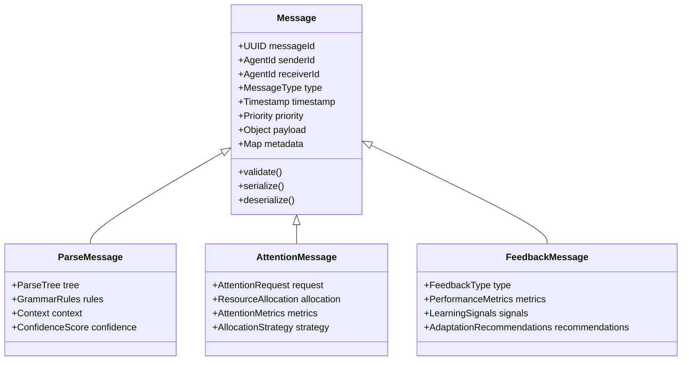

### Agent State Machine

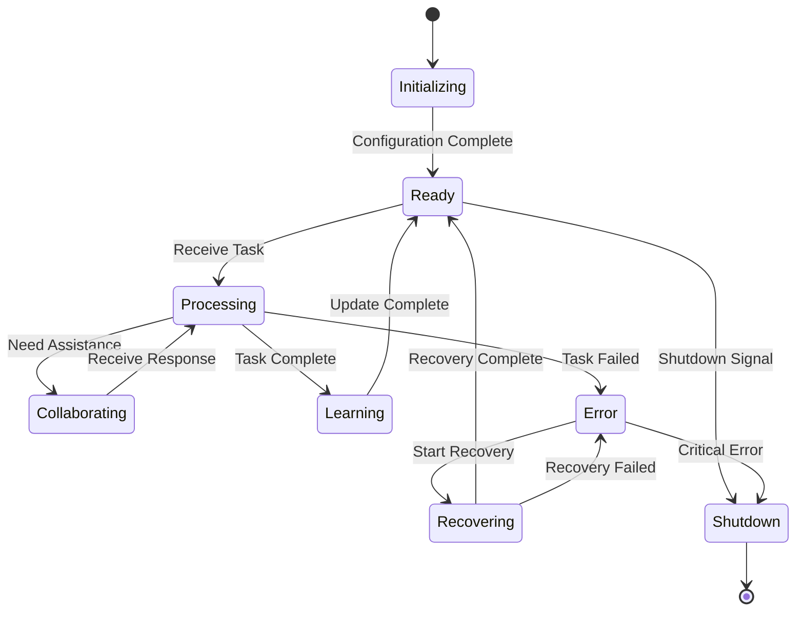

## Hypergraph Implementation

### Node Types and Properties

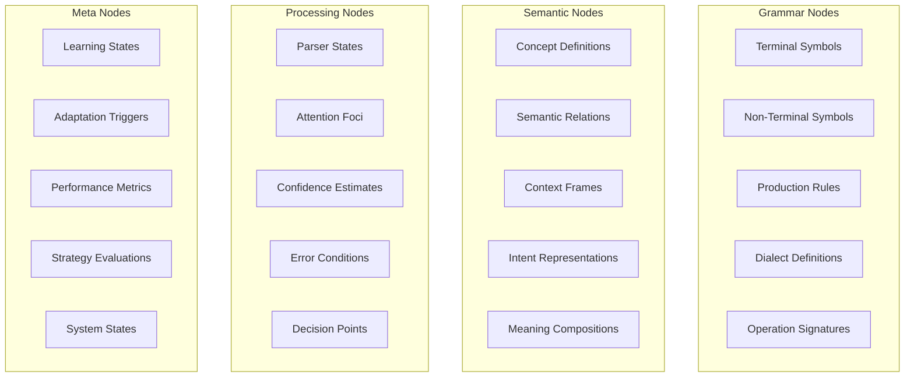

### Hyperedge Dynamics

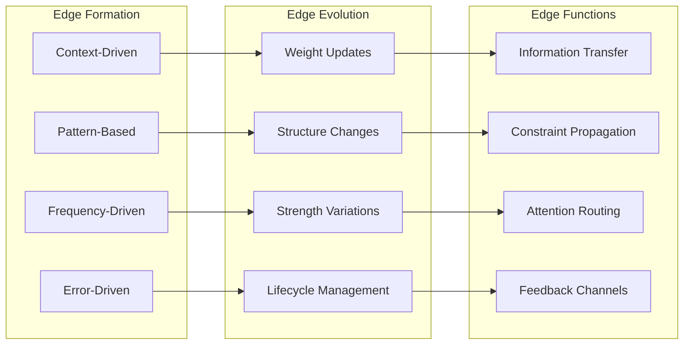

## Attention Allocation Algorithms

### Priority Calculation

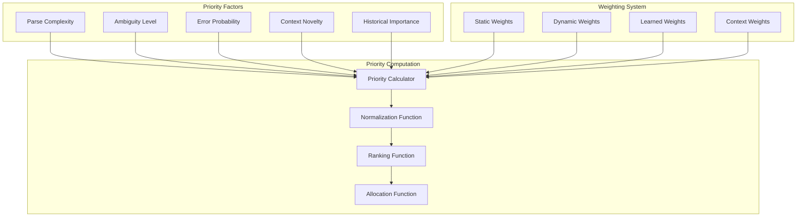

### Resource Allocation Strategies

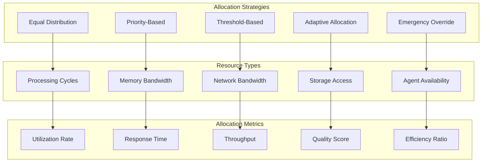

## Learning and Adaptation Mechanisms

### Multi-Level Learning Architecture

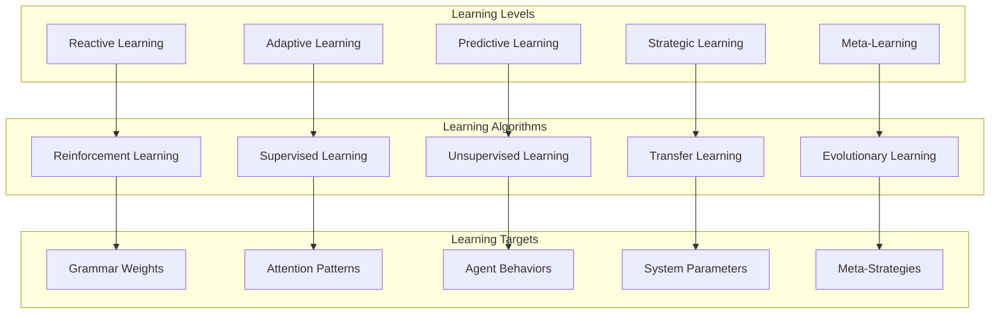

### Feedback Processing Pipeline

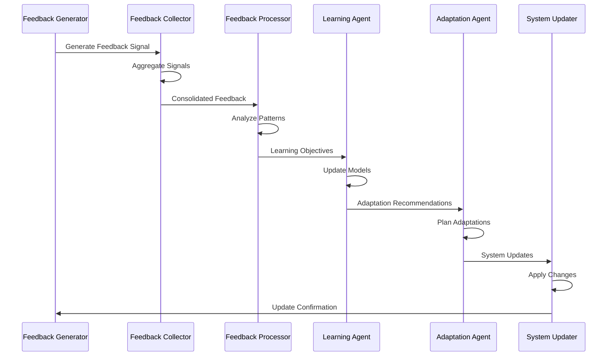

## Recursive Processing Patterns

### Fractal Grammar Structure

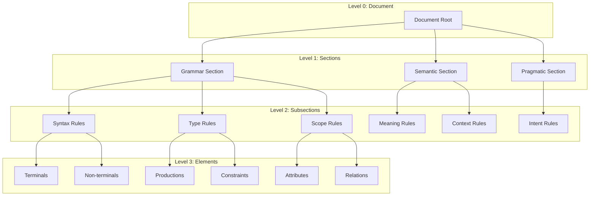

### Self-Similarity Patterns

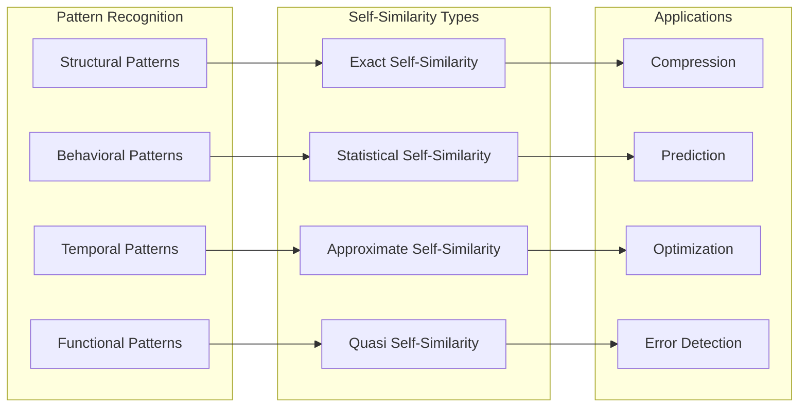

## Performance Metrics and Monitoring

### System Performance Dashboard

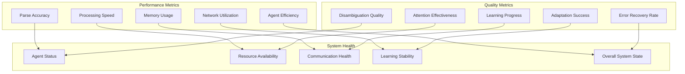

### Monitoring and Alerting System

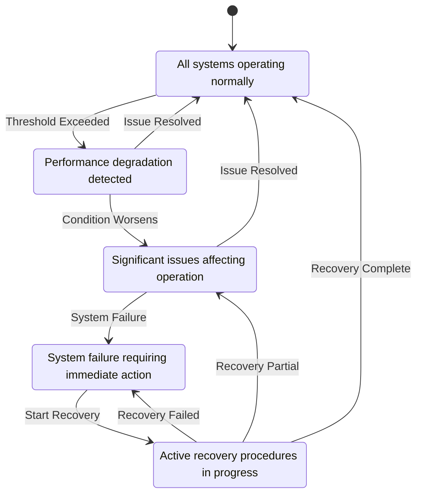