# Distributed Agentic Cognitive Grammar Network (DACGN)

## Executive Summary

The Distributed Agentic Cognitive Grammar Network is a comprehensive framework that models language processing and code analysis as a distributed system of intelligent agents. This network leverages the existing MLIR grammar infrastructure, recursive AST traversal mechanisms, and disambiguation algorithms to create a cognitive architecture capable of sophisticated language understanding, attention allocation, and meta-cognitive feedback.

## Table of Contents

1. [Architecture Overview](#architecture-overview)
2. [Core Components](#core-components)
3. [Hypergraph Mappings](#hypergraph-mappings)
4. [Attention Allocation](#attention-allocation)
5. [Meta-Cognitive Feedback Loops](#meta-cognitive-feedback-loops)
6. [Agent Interactions](#agent-interactions)
7. [Implementation Details](#implementation-details)
8. [Recursive Processing](#recursive-processing)
9. [Testing and Validation](#testing-and-validation)

## Architecture Overview

The DACGN consists of multiple interconnected cognitive agents, each specialized for different aspects of grammar processing and language understanding. The system builds upon the existing LLVM/MLIR infrastructure while adding cognitive capabilities through distributed agent coordination.

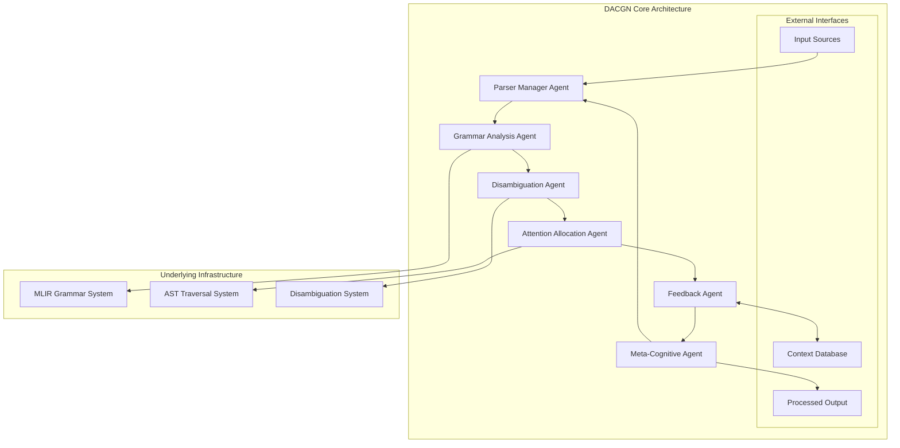

### Key Principles

1. **Distributed Processing**: Each agent operates independently while maintaining coordination
2. **Cognitive Awareness**: Agents maintain models of their own processing capabilities
3. **Adaptive Attention**: Dynamic allocation of processing resources based on complexity
4. **Continuous Learning**: Meta-cognitive feedback enables system improvement over time

## Core Components

### 1. Parser Manager Agent

The Parser Manager Agent orchestrates the overall parsing process and coordinates between different specialized agents.

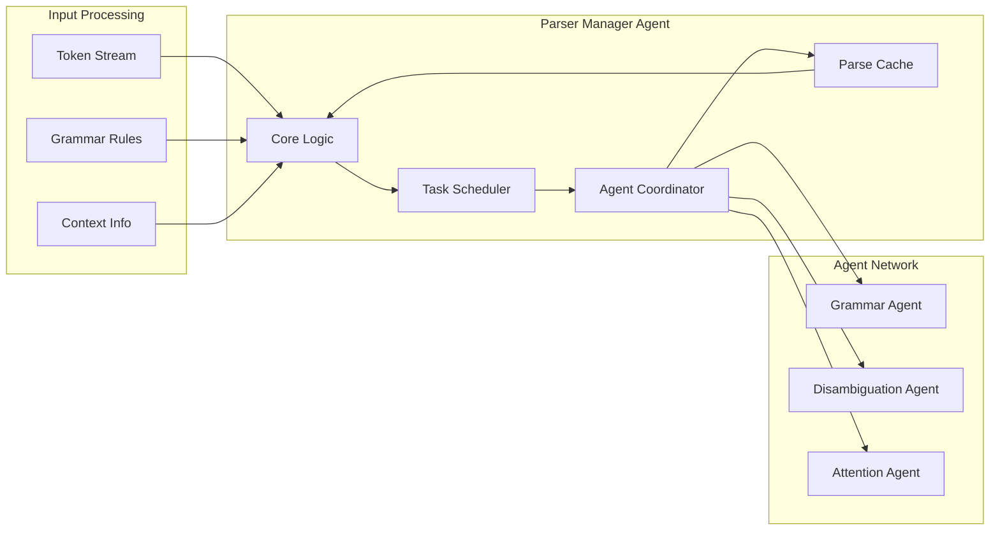

**Responsibilities:**
- Tokenization and initial parsing
- Agent task distribution
- Resource management
- Parse result integration

### 2. Grammar Analysis Agent

Specializes in understanding and applying grammar rules from the MLIR dialect system.

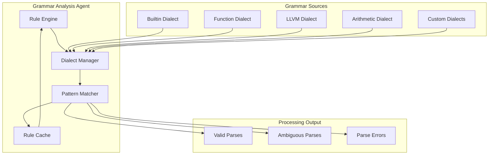

### 3. Disambiguation Agent

Handles resolution of ambiguous parse trees using contextual information and learned patterns.

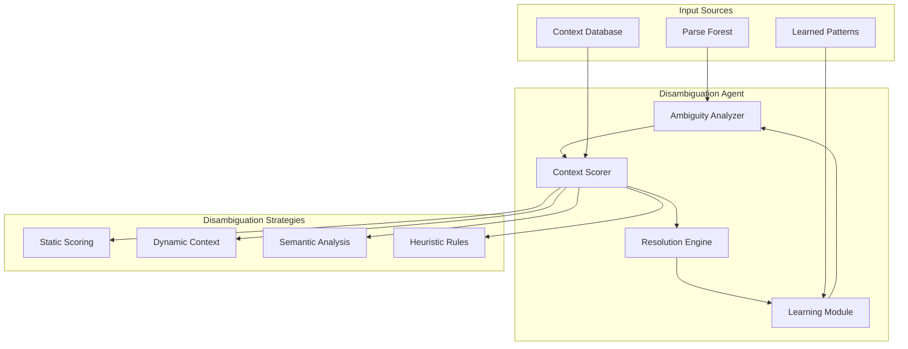

## Hypergraph Mappings

The DACGN uses hypergraph structures to represent complex relationships between grammar elements, semantic concepts, and processing states.

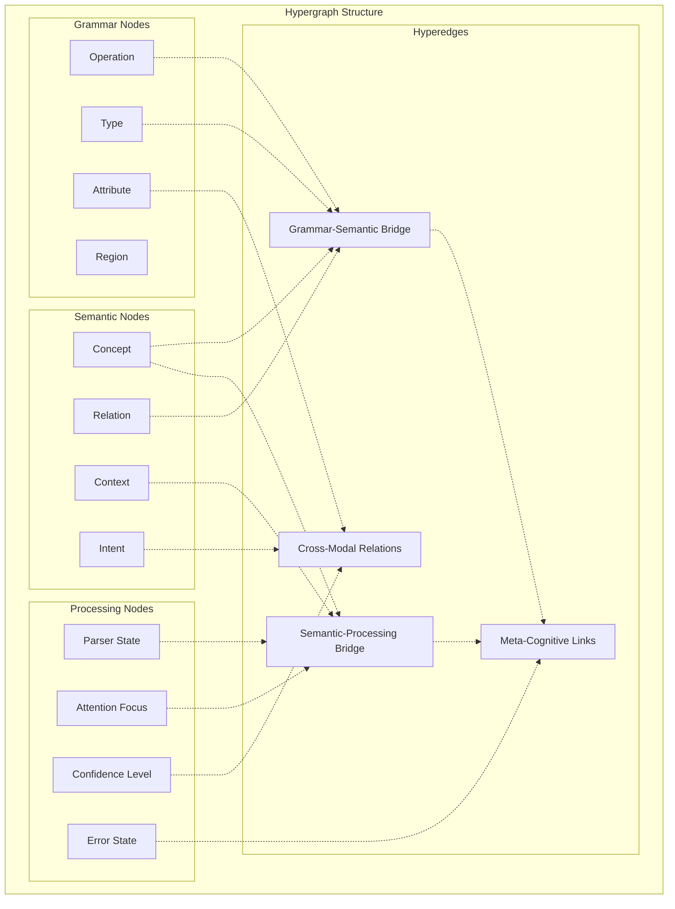

### Hypergraph Properties

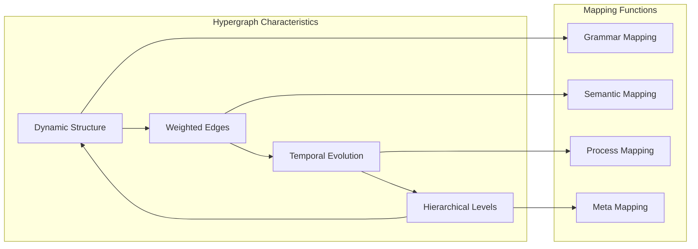

## Attention Allocation

The attention mechanism dynamically allocates processing resources based on parse complexity, ambiguity levels, and contextual importance.

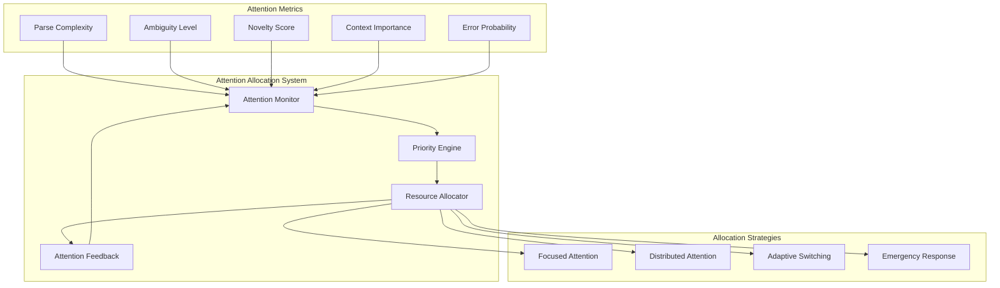

### Attention Dynamics

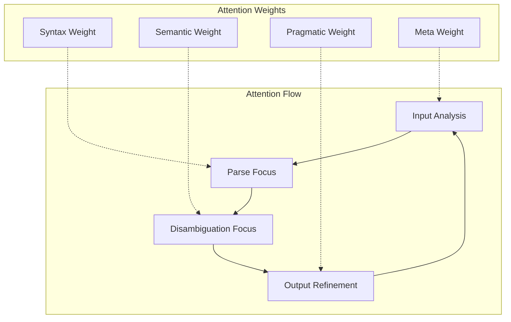

## Meta-Cognitive Feedback Loops

The system implements multiple feedback mechanisms that enable learning and adaptation over time.

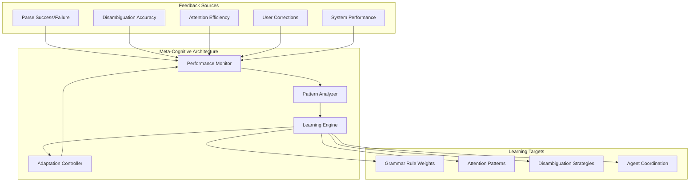

### Feedback Loop Types

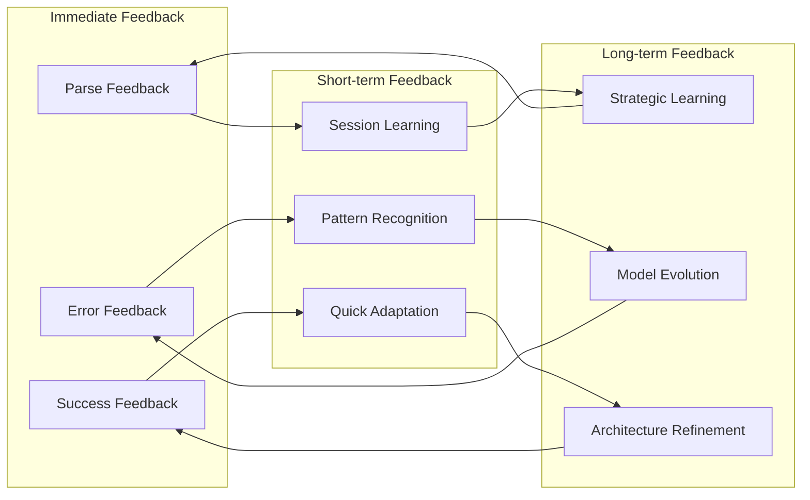

## Agent Interactions

The distributed agents interact through sophisticated communication protocols and shared knowledge structures.

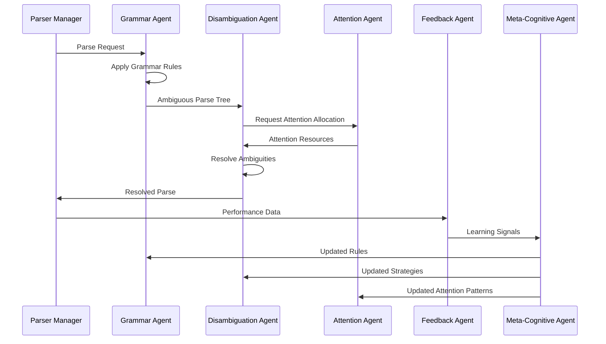

### Communication Protocols

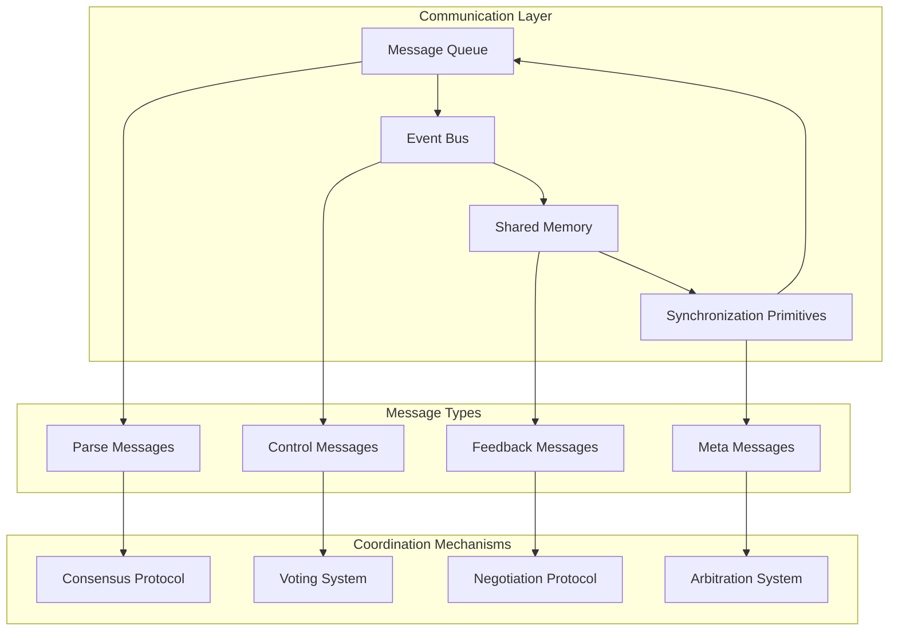

## Implementation Details

### Core Data Structures

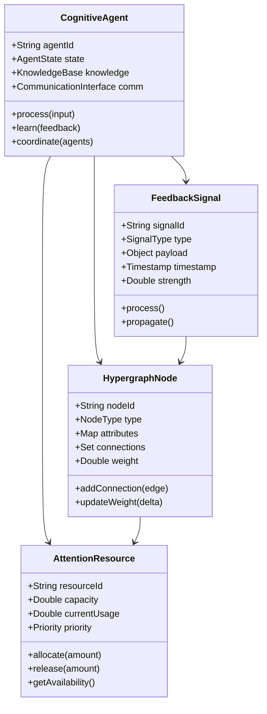

## Recursive Processing

The system implements recursive processing patterns that mirror the structure found in the RecursiveASTVisitor.

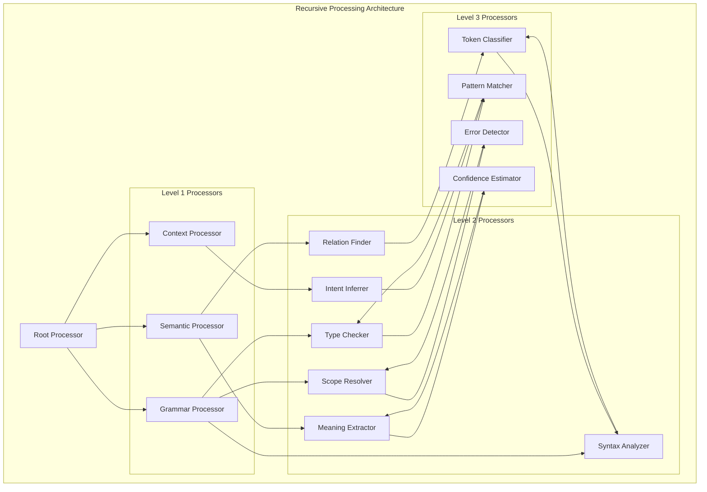

### Recursive Attention Patterns

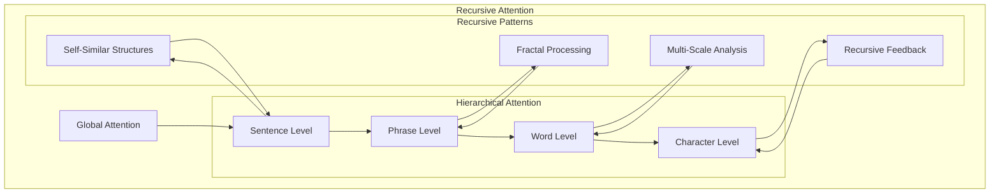

## Testing and Validation

### Test Framework Architecture

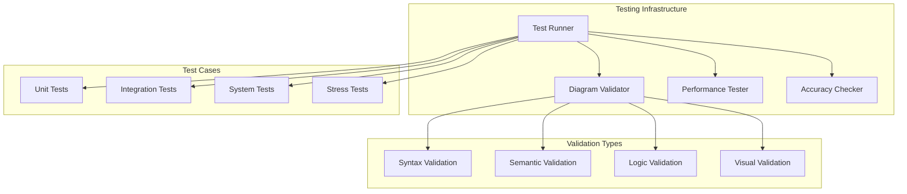

### Diagram Validation Process

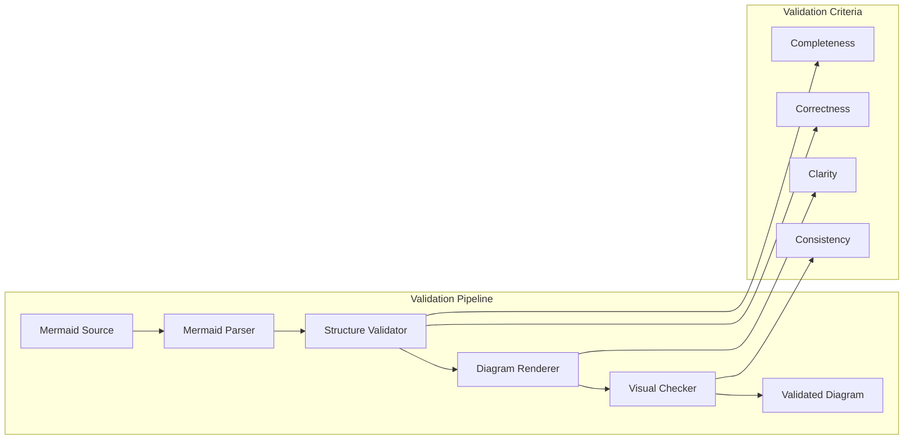

## Conclusion

The Distributed Agentic Cognitive Grammar Network represents a sophisticated approach to language processing that combines the robustness of existing compiler infrastructure with advanced cognitive architectures. Through distributed agent coordination, hypergraph mappings, attention allocation, and meta-cognitive feedback, the system achieves both high performance and adaptive learning capabilities.

The recursive nature of the processing architecture, inspired by patterns found in AST traversal systems, enables scalable and efficient handling of complex grammatical structures while maintaining cognitive awareness at all levels of the processing hierarchy.

## References

1. MLIR Language Reference
2. LLVM RecursiveASTVisitor Documentation
3. Tree-sitter Grammar Specification
4. Disambiguation Algorithms in Parsing
5. Cognitive Architecture Design Patterns
6. Distributed Systems for Language Processing
7. Hypergraph Theory and Applications
8. Attention Mechanisms in AI Systems
9. Meta-Cognitive Learning Frameworks
10. Recursive Processing in Compiler Design